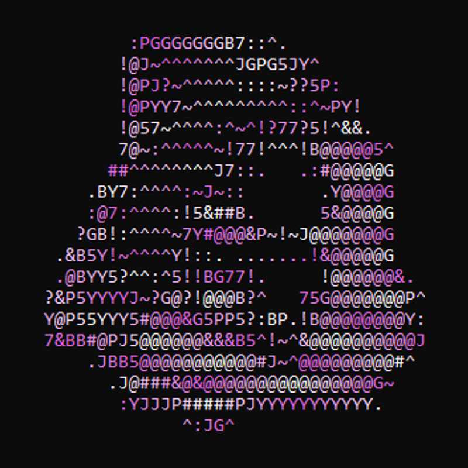
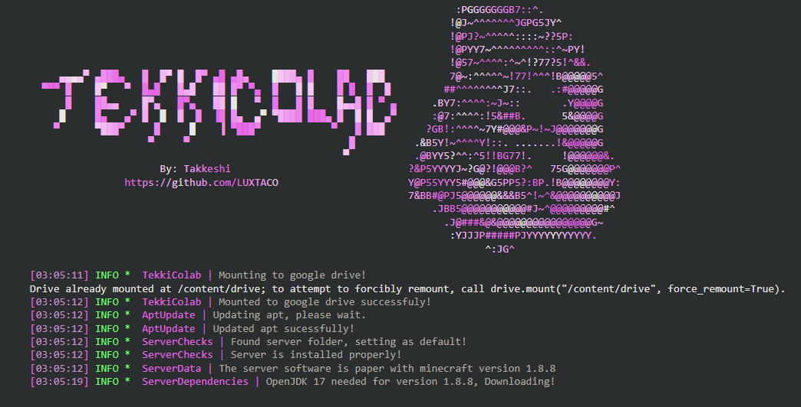
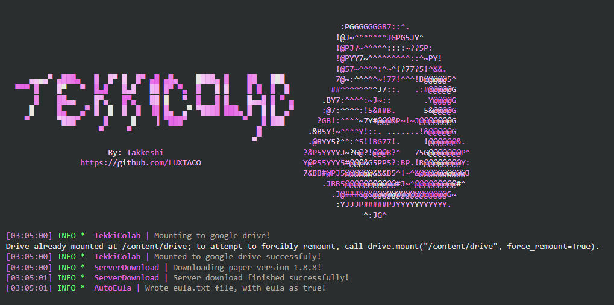
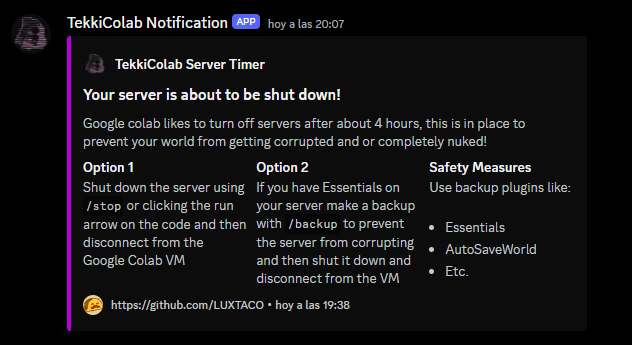

----

  

----
### 
🗄 TekkiColab 🗄

 

  Before you read anything else, If you are looking for the <strong>FULL IN DEPTH</strong> explanation on how this works check out my <a href="https://youtube.com/@takkeshi_dev">channel</a> in which Ill try to upload the in depth explanation of most of my scripts!
    
  TekkiColab is the better version of the MineColab script, its a full rework of the functions.

  <b> >>> JOIN THE DISCORD <<< </b>
     
  https://discord.gg/PdeTUZ3M62

----

### 
🧬 Installation 🧬

 

  <strong>Jupiter Notebook:</strong>
    
  - Upload the notebook to Google Colab
  - Install the server with the first codeblock
  - Start the server with the second codeblock
 
  Super easy to setup!

----
### 
⛑ How it works ⛑

 

**1. Server Configuration:**

- **Server Name:**  Allows you to specify the name of your Minecraft server.
- **Server Flags:** Enables you to customize server settings through additional flags.
- **Tunnel Service:** Provides a choice between "playit" and "ngrok" for creating secure tunnels to access your server.
- **Ngrok Configuration:**  For ngrok users, allows specifying the server region and an API key.

**2. Intelligent Functions (Beta):**

- **Auto Server Timer:**  Sets a timer to send a notification before the Colab session automatically shuts down, preventing data loss.
- **Timer Webhook:**  Requires a Discord webhook URL for sending notifications about the server timer.

**3.  Server Installation and Management:**

- **Installation:** Checks for the existence of a server folder and configures the environment accordingly. If the folder doesn't exist, it guides users through server installation.
- **Dependency Management:** Automatically downloads and installs the appropriate version of OpenJDK (17 or 8) based on the selected Minecraft version.
- **Server Start:**  Initiates the server launch process, including applying custom flags and memory allocation settings.

  

  

  

-----
### 
📦 Contribute 📦

 

  TekkiColab is an open source project and welcomes contributions from anyone who is interested. If you want to help improve the tool, you can fork this repository and make a pull request with your changes. You can also report any issues or suggestions on the issues tab.

----

### 
📌 Disclaimer 📌

 

    Please use this program only for educational purposes.
      
    It is not meant to be used in any malicious way, and I decline any responsibility for what you do with it.
      

-----
